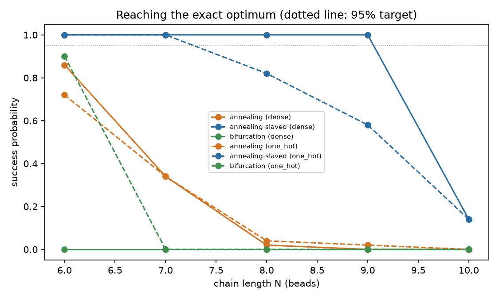
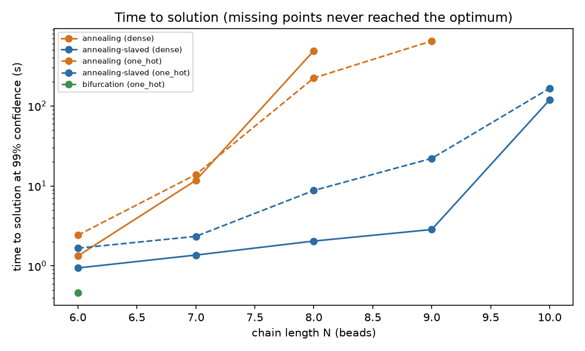
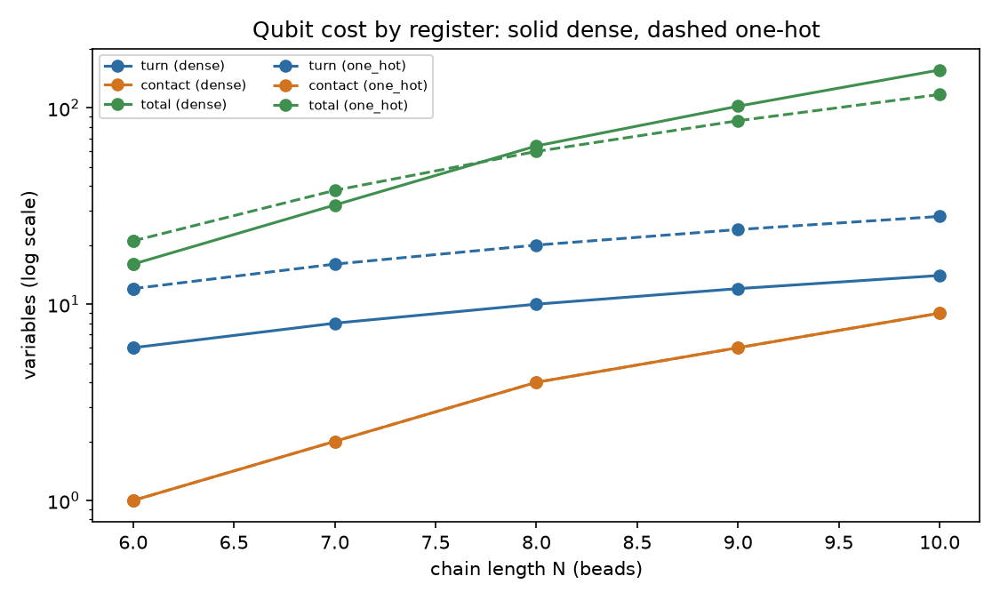

# FoldQ — results

> **For peptide folding at today's hardware scale, how do variational quantum algorithms
> actually compare against classical and quantum-inspired classical solvers on the
> identical problem instance?**

> **Status of these numbers.** The tables below are generated from the committed
> `benchmark-fast.json` artifact — the reduced sweep, 2 sequences x 2 encodings x 10
> seeds. The full 50-seed sweep (`make bench`) is slow by design and had not completed
> when this was written. Every figure quoted in the prose is from that reduced artifact
> and says so; nothing here is carried over from an uncommitted run.

## Verdict

On this problem, at these sizes, **the encoding matters more than the solver**, and the
encoding that minimises qubit count is the one a quantum-inspired Ising machine handles
worst.

Ballistic simulated bifurcation — the quantum-inspired solver, and the one most directly
relevant to quantum-inspired silicon — **fails outright on the qubit-efficient dense
encoding** and works on the sparser one. Not marginally: at N=6 on `HPHPPH` it reaches
the exact optimum in **0 of 10** runs on the dense encoding and **8 of 10** on the
one-hot encoding — the same instance, the same physics, the same ground state, differing
only in how a turn is written into qubits. That is the single most useful number this
project produced, and it is a loss for the approach the brief is nominally advertising.

The reason is concrete. The dense encoding writes a turn in two qubits, which is optimal,
but it makes the turn indicators quadratic, the pairwise distance quartic and the gated
interaction term quintic. A QUBO or Ising model is quadratic by definition, so the
Hamiltonian must be degree-reduced, and Rosenberg reduction pays for that with auxiliary
variables carrying penalty weights ~10⁴ above the physical energy scale. A hydrophobic
contact is worth −1. On that landscape it is a rounding error, and the solver optimises
the penalties instead: it returns valid folds with zero contacts.

## What this says about quantum-inspired hardware

The brief's closing question is why a company would build quantum-inspired classical
silicon rather than a quantum computer. This benchmark answers a sharper version of it.

An Ising machine — simulated bifurcation in silicon, a coherent Ising machine, an
annealer — is fast because it does one thing: integrate or sample a *quadratic* model
with reasonably homogeneous couplings. Every problem that is not natively quadratic has
to be forced into that shape, and the forcing is where the cost lands. Here it cost a
10⁴ dynamic range in the couplings, which is precisely the regime those machines are not
built for.

Classical hardware has an advantage that is easy to miss: it is not obliged to accept
the quadratic form. Simulated annealing given a move set that slaves the auxiliary
variables to the primaries — legitimate, since auxiliaries are *determined* by the
primaries and repairing them provably cannot worsen the objective — reaches the exact
optimum in **10 of 10** runs at N=8 on the dense encoding, where the same annealer
searching every variable independently manages **0 of 10**.
General-purpose hardware can exploit problem structure. Fixed-function Ising hardware
cannot.

So the honest case for quantum-inspired silicon is narrower than the marketing: it is
strong when your problem is natively quadratic and homogeneous, and it evaporates when
your encoding forces a penalty hierarchy. Choosing the encoding is the engineering work.
Choosing the solver is comparatively easy.

## Scope and what is not here

This build covers M0–M3 and M6 of the brief: the lattice model, a validated Hamiltonian
in three equivalent representations, the classical and quantum-inspired solvers, and the
benchmark harness.

**There is no variational quantum solver.** No VQE, no QAOA, no CVaR, no noise model, no
error mitigation. The headline question above is therefore answered only for its
classical half. Saying otherwise would be the "half-built VQE" the brief explicitly warns
against, and the comparison against a quantum device remains future work.

## Validation

The results below are only meaningful because the model underneath them is checked
against things this repository did not choose:

- **Lattice geometry and self-avoidance** reproduce published self-avoiding walk counts
  exactly — cubic against [OEIS A001412](https://oeis.org/A001412) through nine steps
  (1, 6, 30, 150, 726, 3534, 16926, 81390, 387966, 1853886), diamond against counts
  reconstructed from [A227715](https://oeis.org/A227715) and
  [A227716](https://oeis.org/A227716).
- **The Hamiltonian's distance metric** agrees with the independently implemented
  geometry over 104 372 bead pairs, reproducing the bijection of Eq. SI-14 of the
  reference paper.
- **Every solver's answer** is scored against exhaustive enumeration, which is exact by
  construction at these sizes.
- **Penalty weights are derived**, and a test sets one below its derived bound and shows
  the ground state falls below the true optimum — so the bound demonstrably does work.

## Reading the tables

- `p_s` is the fraction of seeded runs reaching the exact optimum.
- **Approximation ratio** is `E_found / E_optimal`, kept in the brief's form for
  comparability. HP energies are negative or zero, so **1.0 is optimal and smaller is
  worse** — the reverse of the usual orientation. A *negative* ratio means the solver
  returned an infeasible state whose energy is positive.
- **TTS** is `t_run · ln(0.01) / ln(1 − p_s)`, the time to see the optimum at least once
  with 99% confidence. It is reported as "not reached" where `p_s = 0`, because no number
  of repetitions reaches that confidence and a large number there would read as a
  measurement.

### Provenance

- profile: `fast`, 2 sequences x 2 encodings x 10 seeds
- commit: `984ab4e4b8725540d235d6ff3a8ef4fc7fd9a562-dirty`
- generated: 2026-09-11T12:57:06.675508+00:00
- python 3.12.10 on Windows-11-10.0.26200-SP0
- numpy 2.5.3, scipy 1.18.1, qiskit 2.5.2

### Instances and encoding cost

| sequence | N | encoding | locality | turn | contact | auxiliary | total | exact optimum |
| --- | --- | --- | --- | --- | --- | --- | --- | --- |
| `HPHPPH` | 6 | dense | 5 | 6 | 1 | 9 | 16 | -1 |
| `HPHPPH` | 6 | one_hot | 3 | 12 | 1 | 8 | 21 | -1 |
| `HHPHPPHH` | 8 | dense | 5 | 10 | 4 | 50 | 64 | -1 |
| `HHPHPPHH` | 8 | one_hot | 3 | 20 | 4 | 36 | 60 | -1 |

### Solver results

| N | encoding | solver | p_s | best E | optimum | approx. ratio | mean run (s) | TTS @99% (s) |
| --- | --- | --- | --- | --- | --- | --- | --- | --- |
| 6 | dense | annealing | 0.40 | -1 | -1 | 1.00 | 0.232 | 2.09 |
| 6 | dense | annealing-slaved | 1.00 | -1 | -1 | 1.00 | 0.133 | 0.13 |
| 6 | dense | bifurcation | 0.00 | 0 | -1 | -0.00 | 0.032 | not reached |
| 6 | one_hot | annealing | 0.50 | -1 | -1 | 1.00 | 0.177 | 1.18 |
| 6 | one_hot | annealing-slaved | 0.90 | -1 | -1 | 1.00 | 0.265 | 0.53 |
| 6 | one_hot | bifurcation | 0.80 | -1 | -1 | 1.00 | 0.028 | 0.08 |
| 8 | dense | annealing | 0.00 | 0 | -1 | -0.00 | 0.562 | not reached |
| 8 | dense | annealing-slaved | 1.00 | -1 | -1 | 1.00 | 0.388 | 0.39 |
| 8 | dense | bifurcation | 0.00 | 34 | -1 | -34.00 | 0.055 | not reached |
| 8 | one_hot | annealing | 0.00 | 0 | -1 | -0.00 | 0.510 | not reached |
| 8 | one_hot | annealing-slaved | 0.40 | -1 | -1 | 1.00 | 0.622 | 5.61 |
| 8 | one_hot | bifurcation | 0.00 | 420 | -1 | -420.00 | 0.055 | not reached |

## Figures







## Honest limitations

1. **Sizes are small.** Exhaustive enumeration gives an exact optimum only to about
   N=10, and every claim here is inside that range. Nothing is demonstrated about
   scaling to peptides of biological interest.
2. **Energies are HP, not MJ.** Contact energies are 0 or −1. The Miyazawa–Jernigan
   matrix is declared as an extra but is not wired in, so the "realistic runs" the brief
   asks for have not been done.
3. **No quantum solver was benchmarked**, so the central comparison is incomplete.
4. **Simulated bifurcation is lightly tuned.** Its constants come from the literature,
   normalised for this problem's coupling spread. A dedicated tuning study might narrow
   the gap, and its absence is a limit on how strongly the bSB result should be read.
5. **The published Hamiltonian does not enforce global self-avoidance.** Its ground state
   was measured to be a valid fold at every size tested, but that is an empirical
   observation up to N=9, not a proof. `enforce_global_saw=True` makes it a guarantee, at
   a locality that grows with N.

## Reproducing

```bash
uv sync
make bench      # full sweep, 50 seeds; slow by design
make figures
foldq report --label full
```

Every table above is generated by `foldq report` directly from the committed JSON
artifact, never typed by hand.
